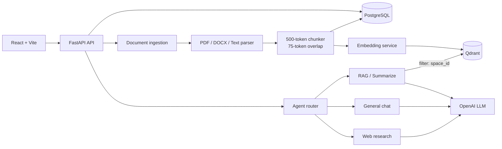

<p align="center">
  
</p>

<h1 align="center">Learn with ICU</h1>

Learn with ICU là một AI learning workspace kết hợp chat thông thường, hỏi đáp trên tài liệu bằng RAG và các công cụ học tập được tạo từ nội dung của từng Learning Space.

Ứng dụng gồm hai trải nghiệm chính:

- **General Chat** (`/chat`): trò chuyện với ICU Tutor mà không truy xuất tài liệu.
- **Learning Workspace** (`/learn`): quản lý Learning Space, đọc tài liệu, hỏi đáp theo đúng tài liệu của space đang chọn và tạo Quiz, Mind map, Flashcards.

> Đây là dự án đang ở giai đoạn phát triển. Hiện chưa có authentication, phân quyền người dùng hoặc durable job queue; xem [Giới hạn hiện tại](#giới-hạn-hiện-tại) trước khi triển khai production.

## Tính năng

### Learning Space và RAG cô lập theo không gian

- Mỗi Learning Space có một `space_id` riêng.
- Mỗi document, vector chunk và learning tool đều thuộc một space.
- `/chat/query` bắt buộc nhận `space_id`.
- Qdrant áp dụng payload filter theo `space_id`, vì vậy truy vấn trong space A không lấy chunk từ space B.
- Dữ liệu cũ chưa có space được đưa vào space `Imported documents` khi backend khởi động.

### Ingestion tài liệu

- Hỗ trợ: PDF, TXT, Markdown, JSON và DOCX.
- Upload được lưu cục bộ trong `uploads/`.
- FastAPI xử lý ingestion bằng background task trong process hiện tại.
- Văn bản được chia bằng recursive token-aware chunking:
  - tối đa `500` tokens/chunk;
  - overlap `75` tokens;
  - ưu tiên giữ nguyên section, paragraph và sentence.
- Embedding mặc định: `text-embedding-3-small`, dimension `1536`.
- Chunk metadata được lưu ở PostgreSQL; embedding và payload được lưu ở Qdrant.

### Document reader

- PDF được hiển thị theo luồng cuộn liên tục, có lazy rendering cho tài liệu dài.
- TXT, Markdown, JSON và DOCX được preview từ nội dung đã trích xuất.
- Chọn một đoạn văn bản để đặt câu hỏi cho ICU Tutor.
- Capture một vùng PDF như ảnh và gửi ảnh kèm câu hỏi cho model có vision.
- Panel PDF có thể resize rộng hơn panel thư viện thông thường.

### Agent và chat

Agent graph hiện có bốn route:

| Route | Khi sử dụng | Hành vi |
| --- | --- | --- |
| `general_chat` | Câu hỏi không gắn Learning Space | Gọi LLM mà không retrieval |
| `rag` | Câu hỏi trong Learning Space | Retrieve chunk theo `space_id`, sau đó sinh câu trả lời có sources |
| `summarize` | Prompt có ý định tóm tắt | Retrieve nhiều context hơn và dùng prompt chuyên biệt |
| `web_research` | Prompt yêu cầu thông tin web/current/latest | Search web, đọc tối đa ba nguồn và tổng hợp câu trả lời |

Web search ưu tiên Tavily khi có `TAVILY_API_KEY`, sau đó fallback sang DuckDuckGo HTML. URL fetch chỉ cho phép địa chỉ HTTP(S) public và chặn localhost/private network.

### Learning tools

- **Quiz**: mặc định 10 câu, tối đa 30 câu; mỗi câu có 4 lựa chọn và phần giải thích.
- **Mind map**: cây chủ đề có thể mở/đóng theo cấp.
- **Flashcards**: mặc định 15 thẻ, tối đa 50 thẻ.
- Mỗi tool có custom prompt và được lưu lại trong PostgreSQL theo `space_id`.
- UI có màn hình học riêng cho từng tool và giữ nguyên tiến trình tương tác phía client.

### Frontend workspace

- React/Vite responsive với hai route `/chat` và `/learn`.
- Workspace ba cột: documents, learning chat và study tools.
- Hai side panel có thể resize, collapse thành icon rail và khôi phục lại.
- Width và collapsed state được lưu trong `localStorage`.
- Tablet/mobile dùng slide-out drawer thay cho desktop resize handles.
- Chat render Markdown, GitHub-Flavored Markdown và công thức LaTeX bằng KaTeX.

## Kiến trúc



### Luồng RAG

1. Client gửi `question`, `session_id` và `space_id` tới `/api/v1/chat/query`.
2. Agent router chọn `rag`, `summarize` hoặc `web_research` dựa trên intent.
3. Với RAG, query được embedding rồi search trong Qdrant bằng filter `space_id`.
4. Các chunk phù hợp được đưa vào prompt của LLM.
5. Backend trả về answer cùng danh sách source chunk và lưu exchange vào PostgreSQL.

## Tech stack

| Layer | Công nghệ |
| --- | --- |
| Frontend | React, Vite, Tailwind CSS, Lucide, React Markdown, KaTeX, React PDF |
| API | FastAPI, Pydantic v2, Uvicorn |
| Agent/RAG | Async Python agent graph, OpenAI SDK, custom retriever/generator |
| Relational data | PostgreSQL 16, SQLAlchemy async, asyncpg |
| Vector store | Qdrant 1.8 |
| Parsing | pypdf, python-docx, BeautifulSoup |
| Chunking | tiktoken |
| Tests | pytest, pytest-asyncio, HTTPX |

## Cấu trúc repository

```text
.
├── backend/src/
│   ├── agent/
│   │   ├── graph.py                 # Async agent graph
│   │   ├── router.py                # Intent routing
│   │   ├── state.py                 # Shared agent state
│   │   ├── nodes/                   # General, RAG, summarize, web research
│   │   └── tools/                   # Web, quiz, mind map, flashcard tools
│   ├── api/
│   │   ├── main.py                  # FastAPI app factory and lifespan
│   │   ├── schemas.py               # Request/response models
│   │   └── routes/                  # Spaces, documents, chat, tools
│   ├── core/                        # Settings and logging
│   ├── embeddings/                  # OpenAI/fallback embeddings
│   ├── ingestion/                   # Parser, chunker, metadata, pipeline
│   ├── rag/                         # Retriever, generator, RAG pipeline
│   ├── storage/                     # PostgreSQL, Qdrant, local files
│   └── workers/                     # In-process ingestion worker
├── frontend/src/
│   ├── api/                         # Backend API clients
│   ├── components/                  # Chat, files, workspace and tool UIs
│   ├── pages/                       # General Chat and Learning Workspace
│   ├── App.jsx                      # Lightweight route switching
│   └── index.css                    # Design tokens and shared styles
├── scripts/init_db.py               # Optional manual DB/vector initialization
├── tests/                           # Backend unit/integration tests
├── uploads/                         # Local document storage
├── docker-compose.yml               # PostgreSQL and Qdrant
├── dev.sh                           # Run backend + frontend together
├── pyproject.toml
└── README.md
```

## Yêu cầu hệ thống

- Python `>= 3.10`
- Node.js và npm
- Docker + Docker Compose, hoặc PostgreSQL/Qdrant đã chạy sẵn
- OpenAI API key để có câu trả lời LLM thật và tạo structured learning tools

## Quick start

### 1. Chuẩn bị environment

```bash
cp .env.example .env
```

Ít nhất nên cập nhật:

```dotenv
OPENAI_API_KEY=your_openai_api_key
LANGCHAIN_API_KEY=
```

Không commit file `.env` lên Git.

### 2. Chạy toàn bộ development stack

```bash
chmod +x dev.sh
./dev.sh
```

Script sẽ:

1. khởi động PostgreSQL và Qdrant bằng Docker Compose nếu Docker khả dụng;
2. tạo `.venv` và cài backend dependencies ở lần chạy đầu;
3. cài frontend dependencies nếu chưa có;
4. chạy FastAPI ở port `8000`;
5. chạy Vite ở port `5173`.

Mở:

- Frontend: [http://localhost:5173](http://localhost:5173)
- Learning Workspace: [http://localhost:5173/learn](http://localhost:5173/learn)
- Swagger UI: [http://localhost:8000/docs](http://localhost:8000/docs)
- ReDoc: [http://localhost:8000/redoc](http://localhost:8000/redoc)
- Health check: [http://localhost:8000/health](http://localhost:8000/health)
- Qdrant dashboard: [http://localhost:6333/dashboard](http://localhost:6333/dashboard)

Nhấn `Ctrl+C` để dừng frontend và backend. PostgreSQL/Qdrant containers vẫn tiếp tục chạy; dừng chúng bằng:

```bash
docker compose stop
```

Nếu database services đã chạy bên ngoài Docker:

```bash
SKIP_DOCKER=1 ./dev.sh
```

## Chạy thủ công

### Backend services

```bash
docker compose up -d postgres qdrant
```

### Backend API

```bash
python3 -m venv .venv
source .venv/bin/activate
pip install -e ".[dev]"
cp .env.example .env

PYTHONPATH=backend uvicorn src.api.main:app --reload --port 8000
```

FastAPI tự tạo bảng và Qdrant collection khi startup. Có thể chạy initialization riêng nếu cần:

```bash
PYTHONPATH=backend python scripts/init_db.py
```

### Frontend

```bash
cd frontend
npm install
npm run dev
```

Trong local development, Vite proxy `/api` tới `http://localhost:8000`. Khi frontend gọi backend đã deploy, tạo `frontend/.env`:

```bash
cp frontend/.env.example frontend/.env
```

```dotenv
VITE_API_URL=https://your-api.example.com/api/v1
```

## Cấu hình

Backend đọc biến môi trường từ `.env` tại project root.

| Biến | Mặc định | Mô tả |
| --- | --- | --- |
| `APP_DEBUG` | `True` | Debug logging và SQLAlchemy query logging |
| `DATABASE_URL` | PostgreSQL local | SQLAlchemy async connection URL |
| `QDRANT_HOST` | `localhost` | Qdrant host |
| `QDRANT_PORT` | `6333` | Qdrant HTTP port |
| `QDRANT_COLLECTION_NAME` | `rag_documents` | Collection chứa document chunks |
| `UPLOAD_DIR` | `./uploads` | Thư mục lưu file upload |
| `OPENAI_API_KEY` | rỗng | OpenAI embeddings, chat và learning tools |
| `EMBEDDING_MODEL_NAME` | `text-embedding-3-small` | Embedding model |
| `EMBEDDING_DIMENSION` | `1536` | Vector dimension; phải khớp Qdrant collection |
| `LLM_MODEL_NAME` | `gpt-4o-mini` | Model dùng cho chat và structured tools |
| `TAVILY_API_KEY` | rỗng | Web search provider ưu tiên; không có sẽ dùng DuckDuckGo |
| `LANGCHAIN_TRACING_V2` | `True` | Bật cấu hình tracing khi có LangSmith key |
| `LANGCHAIN_API_KEY` | rỗng | LangSmith tracing key, tùy chọn |
| `LANGCHAIN_PROJECT` | `learn-with-icu` | Tên project tracing |
| `VITE_API_URL` | `/api/v1` | Frontend API base; chỉ cần override khi deploy |

### Chế độ không có OpenAI key

- Embedding service dùng deterministic fallback vector để hỗ trợ development/test.
- General Chat và RAG trả về fallback response thay vì câu trả lời LLM hoàn chỉnh.
- Quiz, Mind map và Flashcards yêu cầu `OPENAI_API_KEY`; endpoint sẽ báo lỗi nếu thiếu key.

## API chính

Base path: `/api/v1`

| Method | Endpoint | Mô tả |
| --- | --- | --- |
| `GET` | `/spaces` | Danh sách Learning Spaces |
| `POST` | `/spaces` | Tạo Learning Space |
| `DELETE` | `/spaces/{space_id}` | Xóa space và dữ liệu liên quan |
| `GET` | `/documents` | Danh sách documents; hỗ trợ filter `space_id` |
| `POST` | `/documents/upload` | Upload file bằng multipart `file` + `space_id` |
| `GET` | `/documents/{id}` | Trạng thái và metadata document |
| `GET` | `/documents/{id}/content` | Nội dung file gốc để preview |
| `GET` | `/documents/{id}/text` | Văn bản đã trích xuất |
| `DELETE` | `/documents/{id}` | Xóa metadata, file và vectors |
| `POST` | `/chat/general` | Chat không retrieval |
| `POST` | `/chat/query` | Agent/RAG query theo Learning Space |
| `POST` | `/chat/stream` | Streaming RAG response dạng `text/event-stream` |
| `GET` | `/tools` | Danh sách tool theo `space_id` và `tool_type` |
| `POST` | `/tools/quiz` | Tạo và lưu quiz |
| `POST` | `/tools/mindmap` | Tạo và lưu mind map |
| `POST` | `/tools/flashcards` | Tạo và lưu flashcards |
| `DELETE` | `/tools/{tool_id}` | Xóa learning tool |

### Ví dụ API

Tạo Learning Space:

```bash
curl -X POST http://localhost:8000/api/v1/spaces \
  -H 'Content-Type: application/json' \
  -d '{"name":"AI Engineering","color":"teal"}'
```

Upload document bằng `space_id` trả về từ bước trên:

```bash
curl -X POST http://localhost:8000/api/v1/documents/upload \
  -F 'space_id=YOUR_SPACE_ID' \
  -F 'file=@./book.pdf'
```

Kiểm tra document cho đến khi `status` là `completed`:

```bash
curl http://localhost:8000/api/v1/documents/YOUR_DOCUMENT_ID
```

Hỏi trong Learning Space:

```bash
curl -X POST http://localhost:8000/api/v1/chat/query \
  -H 'Content-Type: application/json' \
  -d '{
    "question": "Tóm tắt các ý chính trong tài liệu",
    "session_id": "demo-session",
    "space_id": "YOUR_SPACE_ID",
    "top_k": 5,
    "score_threshold": 0
  }'
```

Chat không dùng tài liệu:

```bash
curl -X POST http://localhost:8000/api/v1/chat/general \
  -H 'Content-Type: application/json' \
  -d '{"question":"Giải thích recursion dễ hiểu", "session_id":"demo-session"}'
```

## Data persistence

| Dữ liệu | Nơi lưu |
| --- | --- |
| Learning Spaces, document records, chunks, chat messages, learning tools | PostgreSQL |
| Vector embeddings và searchable payload | Qdrant |
| File upload gốc | `uploads/` |
| Panel width, collapse state và custom prompt phía client | Browser `localStorage` |

Docker volumes `postgres_data` và `qdrant_data` giữ dữ liệu qua các lần restart container.

## Kiểm thử

Chạy backend tests:

```bash
PYTHONPATH=backend .venv/bin/python -m pytest -q
```

Một số API integration tests cần PostgreSQL đang chạy.

Build frontend:

```bash
npm --prefix frontend run build
```

Test suite hiện bao phủ:

- API health, Learning Space lifecycle và validation `space_id`;
- recursive token-aware chunking;
- agent routing;
- quiz/flashcard count parsing và mind map schema;
- web search parsing và safe URL fetching.

## Giới hạn hiện tại

- Chưa có đăng nhập, authorization hoặc isolation theo user.
- CORS đang cho phép mọi origin; cần giới hạn lại khi deploy.
- Ingestion chạy bằng FastAPI `BackgroundTasks`, không phải durable queue. Job có thể mất nếu process restart.
- Object storage hiện chỉ hỗ trợ local filesystem; S3/MinIO mới dừng ở mức interface định hướng.
- Qdrant là vector backend hoàn chỉnh hiện tại; nhánh `pgvector` vẫn là placeholder.
- Frontend đang dùng response thường cho chat; `/chat/stream` có ở backend nhưng chưa được nối vào UI.
- Không có migration framework như Alembic; startup chỉ thực hiện một số migration sớm cho `space_id`.
- Fallback embedding không thay thế embedding model thật cho chất lượng retrieval production.

## Troubleshooting

### Backend báo không kết nối được PostgreSQL hoặc Qdrant

```bash
docker compose ps
docker compose up -d postgres qdrant
```

Kiểm tra `DATABASE_URL`, `QDRANT_HOST` và `QDRANT_PORT` trong `.env`.

### Chat chỉ trả về “Fallback mode”

Thiết lập `OPENAI_API_KEY` trong `.env`, sau đó restart backend.

### Learning tool trả lỗi 502

Quiz, Mind map và Flashcards cần OpenAI key hợp lệ và model hỗ trợ JSON response.

### Đã đổi embedding dimension

`EMBEDDING_DIMENSION` phải trùng với dimension của Qdrant collection. Khi đổi model/dimension, hãy dùng collection mới hoặc recreate collection và ingest lại tài liệu.

### Frontend không gọi được API

- Local: bảo đảm FastAPI chạy tại `http://localhost:8000` để Vite proxy hoạt động.
- Deploy: đặt `VITE_API_URL` thành URL đầy đủ kết thúc ở `/api/v1` trước khi build frontend.
