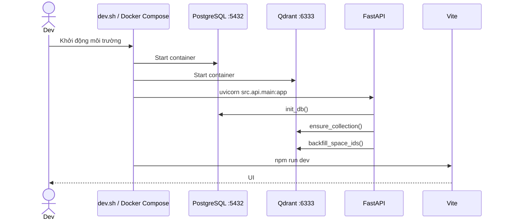

# Flow 01 — Khởi động hệ thống

## Mục đích

Đưa PostgreSQL, Qdrant, backend và frontend vào trạng thái phục vụ được; đồng thời đảm bảo schema và collection vector tồn tại.

## Các bước

1. Docker Compose start PostgreSQL và Qdrant; port host phải chưa bị chiếm.
2. FastAPI chạy lifespan startup.
3. `init_db()` tạo các bảng và chạy các migration tương thích cho cột mới như `fixed_context`, `space_id`, context summary/boundary, excluded và cleared timestamp.
4. Qdrant tạo collection `rag_documents` với dimension embedding từ cấu hình và cosine distance.
5. Payload vector cũ được backfill `space_id` nếu có thể suy ra từ PostgreSQL.
6. Router `/api/v1` cho chat, documents, profile, spaces và tools được đăng ký.
7. Vite phục vụ frontend; request `/api/v1` được gửi tới backend theo `VITE_API_URL` hoặc proxy mặc định.

## Điều kiện lỗi

- Port `5432` hoặc `6333` đã dùng: container tương ứng không bind được; ví dụ Qdrant báo `port is already allocated`.
- PostgreSQL chưa sẵn sàng: `init_db` thất bại và backend không hoàn tất startup.
- Qdrant không sẵn sàng: phần vector/RAG không hoạt động dù frontend có thể vẫn tải.
- Warning `docker-compose.yml version is obsolete` không phải lỗi runtime.

## Code liên quan

- `docker-compose.yml`, `dev.sh`
- `backend/src/api/main.py`
- `backend/src/storage/postgres.py`
- `backend/src/storage/vector_store.py`
- `backend/src/core/config.py`

