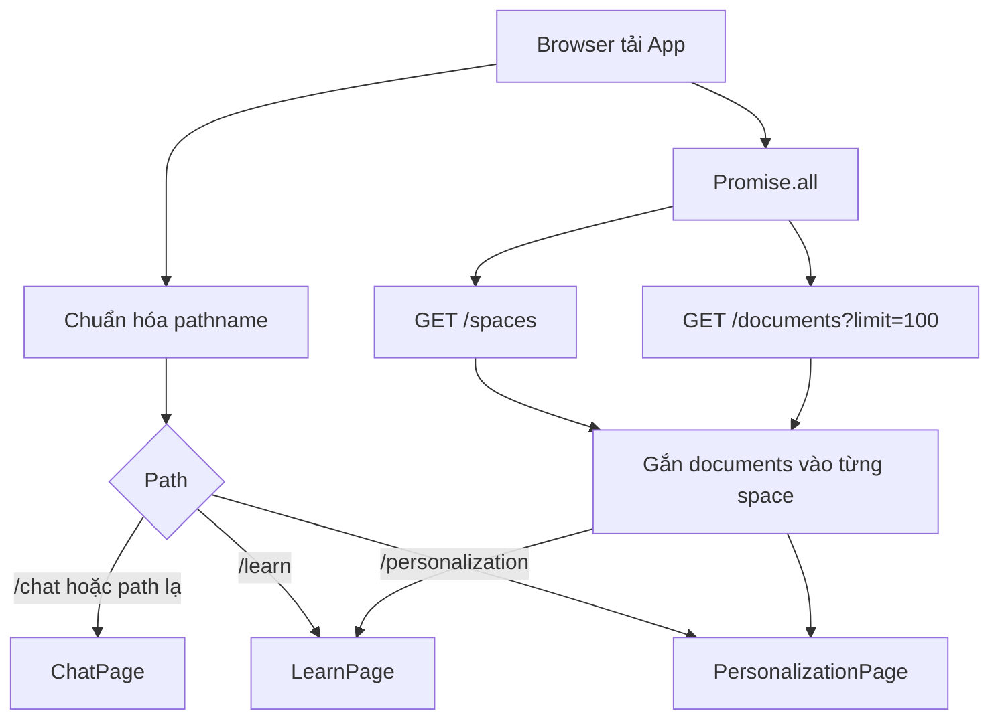

# Flow 02 — Khởi động frontend và điều hướng

## Chi tiết

1. `App` chỉ chấp nhận ba path; path khác được quy về `/chat`.
2. Điều hướng dùng History API (`pushState`, `replaceState`, `popstate`), không dùng React Router.
3. Khi mount, frontend tải spaces và documents song song.
4. Documents được lọc theo `document.space_id`, chuyển sang shape UI bằng `toFrontendFile`, rồi gắn vào `space.files`.
5. Trạng thái lỗi tải documents/spaces được chia sẻ cho Learning Workspace.
6. `ChatPage` tự tải conversation riêng; `PersonalizationPage` tự tải global memories; `LearnPage` nhận spaces/documents từ `App`.

## State tồn tại bao lâu

- `learningSpaces`: tồn tại đến khi reload trang.
- Layout width/prompt tùy chỉnh: lưu trong `localStorage`.
- Conversation General Chat: lưu backend, có thể mở lại.
- Message Learning Chat: chỉ ở React state, không được load lại sau refresh dù backend vẫn ghi `ChatMessage` theo `session_id`.

## Code liên quan

- `frontend/src/App.jsx`
- `frontend/src/api/*.js`
- `frontend/src/pages/ChatPage.jsx`
- `frontend/src/pages/LearnPage.jsx`
- `frontend/src/pages/PersonalizationPage.jsx`

