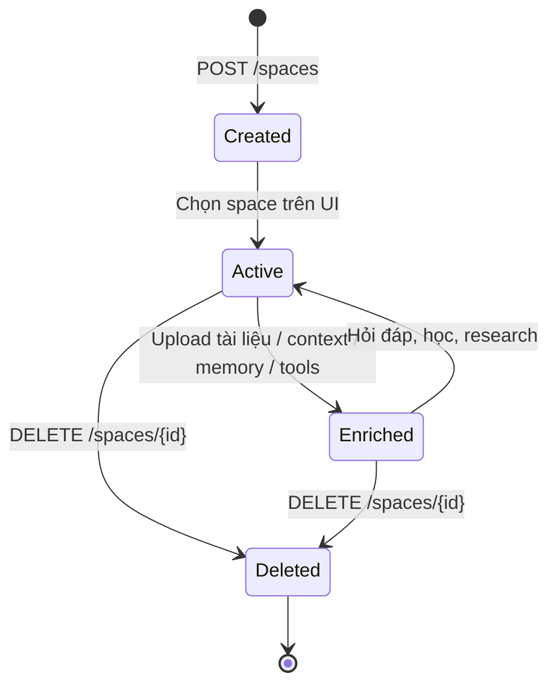
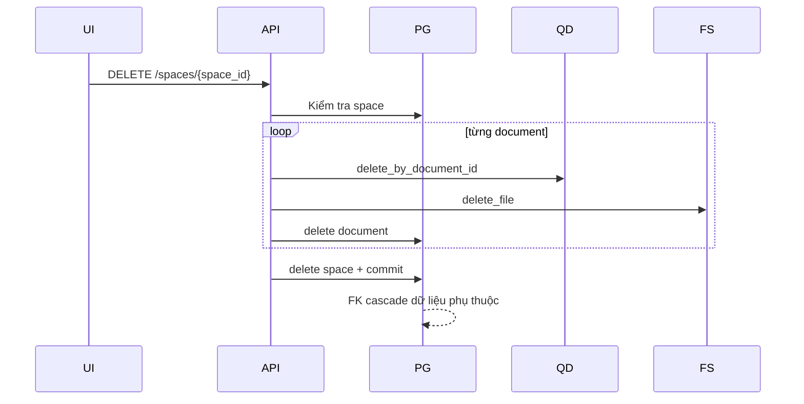

# Flow 03 — Vòng đời Learning Space

## Tạo và chọn space

1. Người dùng nhập tên trong `DocumentsPanel`.
2. `LearnPage.createSpace` chọn màu tuần tự và gọi `POST /spaces`.
3. Backend tạo UUID, lưu `LearningSpace`, commit và trả bản ghi.
4. Frontend thêm `{...created, files: []}`, tạo opening message và chọn space mới.

## Tài nguyên thuộc space

- Documents và chunks.
- Vector Qdrant có payload `space_id`.
- Fixed workspace context.
- Space-scoped long-term memories.
- Concepts, edges, concept sources.
- Learner concept states.
- Learning tools.
- Chat messages có `space_id` khi dùng Learning Chat.

## Xóa space

## Ranh giới isolation

Mọi retrieval chính đều filter bằng `space_id`. Repository knowledge và learner cũng kiểm tra concept thuộc đúng space. Đây là biên ngăn dữ liệu giữa các workspace.

## Code liên quan

- `backend/src/api/routes/spaces.py`
- `backend/src/storage/postgres.py`
- `frontend/src/pages/LearnPage.jsx`
- `frontend/src/components/workspace/DocumentsPanel.jsx`

