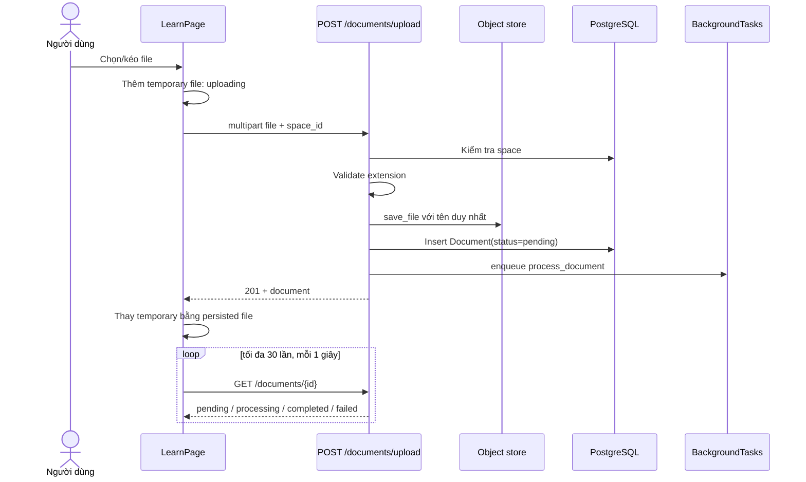

# Flow 04 — Upload tài liệu từ UI

## Quy tắc

- Space phải tồn tại.
- Loại file được parser hỗ trợ: PDF, TXT, Markdown, DOCX, JSON.
- File UI tạm thời bị xóa nếu upload API thất bại.
- Sau 30 lần poll, UI dừng tự hỏi trạng thái; backend có thể vẫn xử lý tiếp.
- Khi `completed`, UI đổi status thành `ready` và thêm assistant notification vào space.

## Dữ liệu tạo ban đầu

`Document`: ID, `space_id`, filename gốc, file type, size, đường dẫn object store, status `pending`, chunk count ban đầu.

## Code liên quan

- `frontend/src/pages/LearnPage.jsx`: `upload`, `pollDocument`
- `frontend/src/api/documents.js`
- `backend/src/api/routes/documents.py`
- `backend/src/storage/object_store.py`

