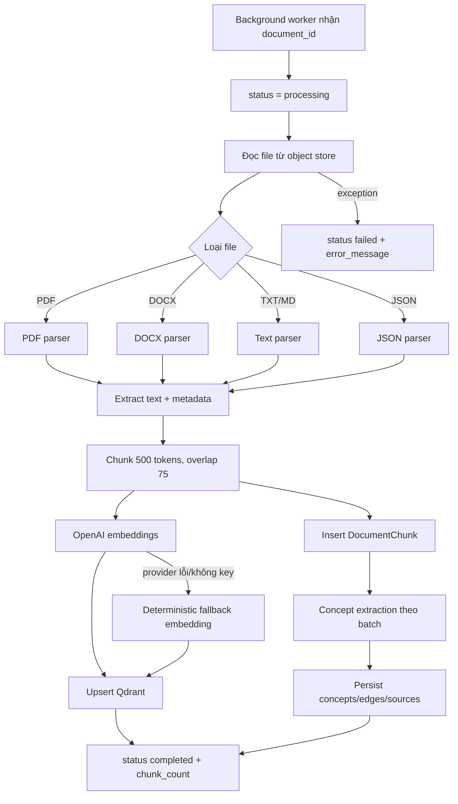

# Flow 05 — Ingestion, chunking và indexing

## Pipeline chi tiết

1. Worker mở session riêng và lấy `Document`.
2. Chuyển status sang `processing`.
3. Parser chọn theo extension, trả text và metadata như page khi có.
4. `TextChunker` tạo đoạn khoảng 500 token, overlap 75 để không mất ngữ cảnh ở biên.
5. Mỗi chunk có ID ổn định trong PostgreSQL và vector payload gồm `document_id`, `space_id`, source, chunk index, text, metadata.
6. Embedding chuẩn dùng model cấu hình (mặc định `text-embedding-3-small`, dimension 1536).
7. Vector được upsert Qdrant; nội dung chunk được ghi PostgreSQL để đọc, lexical search và concept source.
8. Concept extractor chạy theo batch; kết quả được merge theo normalized concept name, không xóa knowledge cũ.
9. Thành công: `completed`; thất bại: `failed` và giữ message lỗi để API trả trạng thái.

## Tính nhất quán và giới hạn

- Qdrant và PostgreSQL không nằm trong cùng distributed transaction; lỗi giữa hai nơi có thể tạo dữ liệu một phần.
- Knowledge extraction là enrichment: ingestion vẫn có giá trị RAG ngay cả khi extraction concept gặp lỗi.
- Fallback embedding giúp test/dev chạy nhưng không có chất lượng semantic như provider thật.

## Code liên quan

- `backend/src/ingestion/pipeline.py`, `parser.py`, `chunker.py`, `metadata.py`
- `backend/src/embeddings/service.py`
- `backend/src/workers/tasks.py`
- `backend/src/knowledge/extractor.py`, `repository.py`
- `backend/src/storage/vector_store.py`

