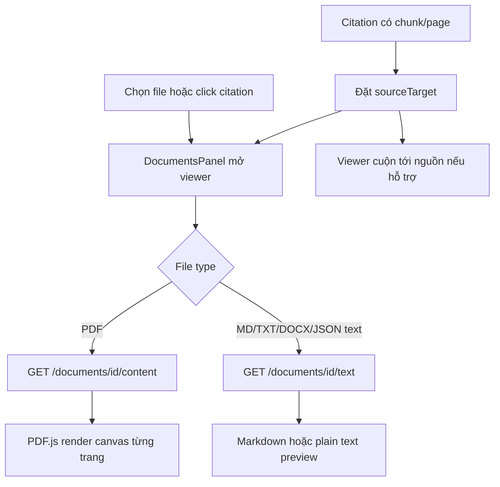
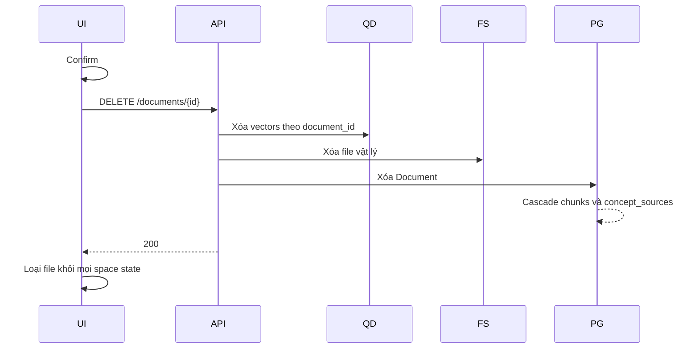

# Flow 06 — Đọc, trích chọn và xóa tài liệu

## Mở tài liệu

## Hỏi từ vùng chọn

1. Với text, người dùng bôi đen; viewer lấy selection tối đa 3.000 ký tự.
2. Với PDF, chế độ Capture cho phép kéo vùng trên canvas.
3. Viewer crop canvas và tạo JPEG data URL chất lượng 0.85.
4. Popover nhận câu hỏi.
5. `LearnPage.send` gửi câu hỏi kèm excerpt hoặc `image_data_url` tới `/chat/stream`.

## Xóa document

## Code liên quan

- `frontend/src/components/workspace/DocumentViewer.jsx`
- `frontend/src/components/workspace/DocumentsPanel.jsx`
- `frontend/src/pages/LearnPage.jsx`
- `backend/src/api/routes/documents.py`

