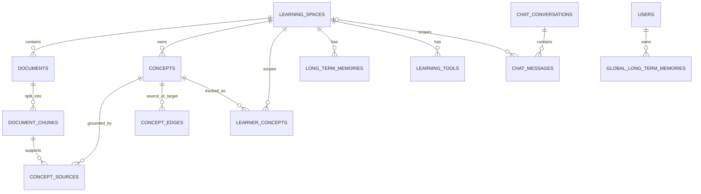

# Flow 07 — Mô hình dữ liệu và nơi lưu trữ

## PostgreSQL

| Bảng | Vai trò chính |
|---|---|
| `learning_spaces` | Boundary của bộ tài liệu và học tập; giữ `fixed_context` |
| `documents` | Metadata file và trạng thái ingestion |
| `document_chunks` | Text chunk dùng lexical search và source linking |
| `chat_conversations` | Title, summary, boundary compaction, clear timestamp |
| `chat_messages` | User/assistant content, sources JSON, token và excluded state |
| `long_term_memories` | Memory chỉ trong một space |
| `global_long_term_memories` | Profile dùng toàn hệ thống |
| `learning_tools` | JSON của quiz/mindmap/flashcards |
| `concepts`, `concept_edges`, `concept_sources` | Knowledge graph có grounding |
| `learner_concepts` | Mastery, confidence, counters, pending assessment |

## Qdrant

Một point cho mỗi document chunk: embedding vector + payload source/document/space/chunk/text/metadata. Search dùng cosine và filter `space_id`.

## Object store

File upload nguyên bản được lưu local dưới `UPLOAD_DIR`; PostgreSQL chỉ giữ đường dẫn.

## Frontend localStorage

- Width/collapse của learning workspace.
- Width sidebar và artifact panel ICU Tutor.
- Prompt tùy chỉnh cho Quiz/Mind map/Flashcards.

## Code liên quan

- `backend/src/storage/postgres.py`, `vector_store.py`, `object_store.py`
- `backend/src/knowledge/models.py`
- `backend/src/learner/models.py`

