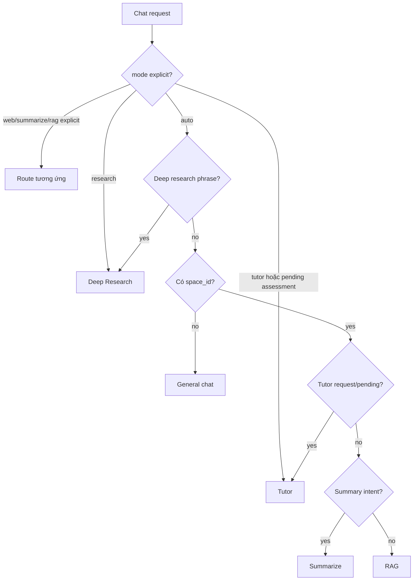

# Flow 08 — Agent routing

## Thứ tự ưu tiên

1. Route/mode do request chỉ định.
2. Cụm từ deep research được nhận diện sớm.
3. Không có `space_id` thì auto trở về general chat.
4. Có assessment Tutor đang chờ hoặc intent Tutor rõ ràng thì Tutor.
5. Ý định summary thì summarizer.
6. Mặc định trong learning space là RAG.

## Node đầu ra

- `general_chat`: LLM với history/context/memory, không document retrieval.
- `rag`: query planner → retrieval → grounded generation.
- `summarize`: retrieval và prompt tóm tắt.
- `web_research`: search/fetch đơn giản.
- `research`: graph nhiều giai đoạn, có progress.
- `tutor`: knowledge graph + learner state + policy.

## Lưu ý

Frontend chỉ cho chọn `auto` hoặc `research`; các route khác chủ yếu được router backend tự phát hiện.

## Code liên quan

- `backend/src/agent/router.py`
- `backend/src/agent/graph.py`
- `backend/src/agent/nodes.py`
- `backend/src/tutor/intents.py`

