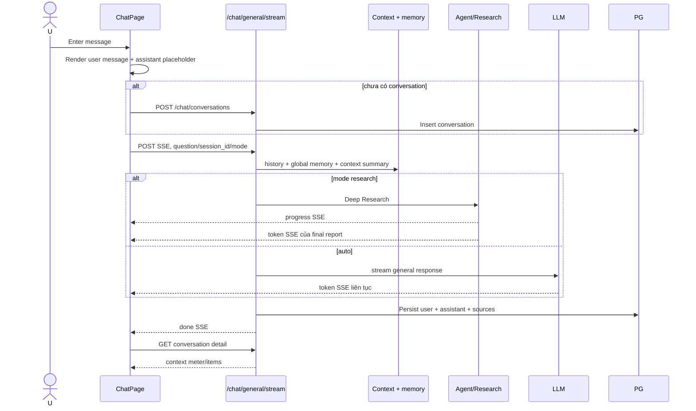

# Flow 09 — General Chat streaming

## SSE contract

- `token`: `{type, token}` để nối vào assistant content.
- `progress`: stage/message/current/total/status đã whitelist.
- `done`: answer, sources và metadata hoàn tất.
- `error`: message; client ném exception.

## UI behavior

- Không mở conversation cũ tự động khi vào trang; màn hình bắt đầu như New Chat.
- Suggested prompts chỉ hiện trước câu hỏi đầu tiên.
- Sau trả lời, title conversation lấy từ câu hỏi đầu, tối đa 72 ký tự.
- Nút Auto/Research truyền mode tới backend.
- Sau `done`, UI refresh context token/items; lỗi refresh không biến câu trả lời thành lỗi.

## Code liên quan

- `frontend/src/pages/ChatPage.jsx`
- `frontend/src/api/chat.js`
- `backend/src/api/routes/chat.py`
- `backend/src/rag/generator.py`

