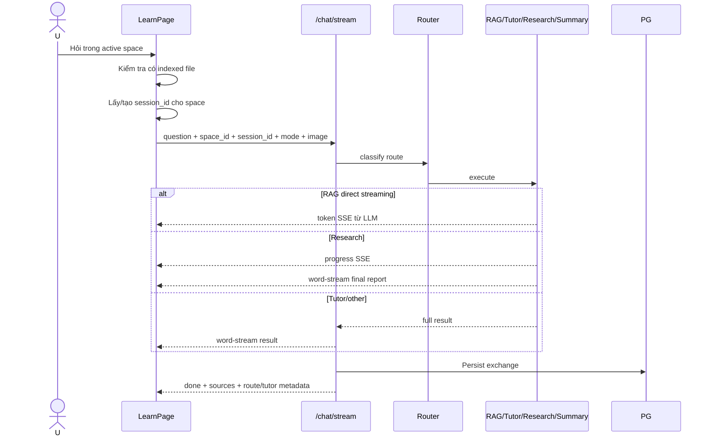

# Flow 10 — Learning Chat streaming

## Guard phía frontend

Không gửi khi: không có active space, chưa có file `ready + persisted`, đang typing hoặc message rỗng.

## Session theo space

`sessionIdsRef` giữ một UUID cho mỗi space trong phiên browser. Reset conversation xóa UUID của space và thay message bằng opening message. Reload trang làm mất message/session map phía UI.

## Image/excerpt

- Text selection được nối vào question dưới nhãn `Selected document excerpt`.
- PDF capture gửi `image_data_url`; schema/backend truyền dữ liệu ảnh vào nhánh có hỗ trợ.

## Khác General Chat

- Không có sidebar conversation hay context meter trong Learning Workspace.
- Opening message là UI-only.
- Response vẫn được backend persist theo `session_id`, nhưng frontend hiện không có flow load lại lịch sử này.

## Code liên quan

- `frontend/src/pages/LearnPage.jsx`
- `frontend/src/api/chat.js`
- `backend/src/api/routes/chat.py`
- `backend/src/agent/graph.py`
