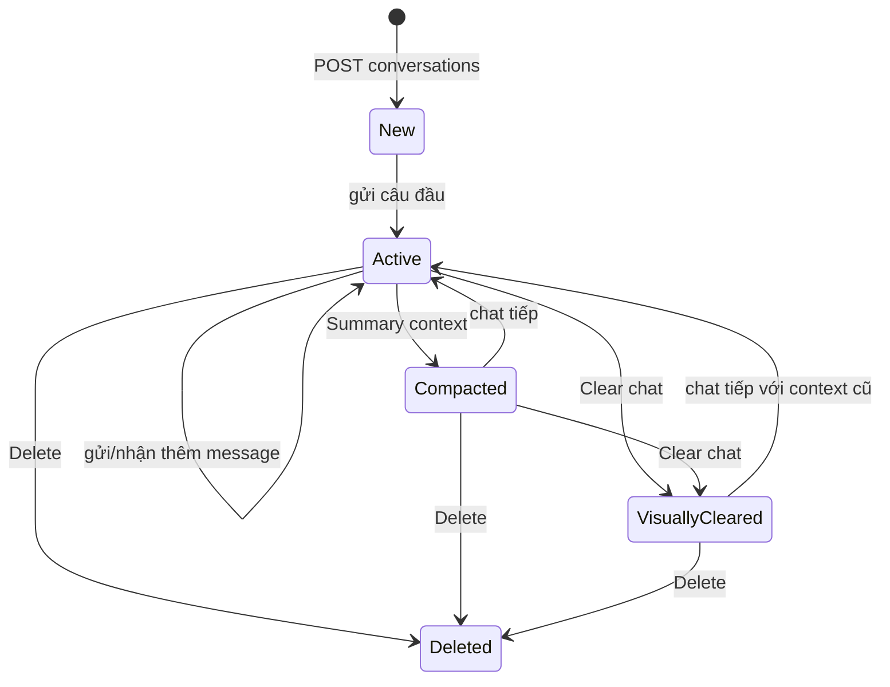

# Flow 11 — Vòng đời conversation

## Tạo và liệt kê

- `POST /chat/conversations` tạo title `New conversation`, chat type general.
- `GET /chat/conversations?chat_type=general` trả danh sách mới cập nhật trước.
- Sidebar tạo, chọn và xóa conversation; thao tác bị khóa trong lúc stream/load/action.

## Mở conversation

Backend trả hai view khác nhau:

1. `messages`: chỉ message còn hiển thị sau `chat_cleared_at`.
2. `context_items`: summary và message còn tham gia context, không phụ thuộc việc đã clear UI.

Frontend dùng request counter để response của lần mở cũ không ghi đè conversation mới vừa chọn.

## Persist exchange

Sau khi AI hoàn tất, backend lưu user message và assistant message, sources/metadata, token count; conversation được cập nhật title/timestamp. Nếu generation lỗi trước khi hoàn tất, exchange không được xem là response thành công.

## Code liên quan

- `backend/src/api/routes/chat.py`
- `backend/src/storage/postgres.py`
- `frontend/src/pages/ChatPage.jsx`
- `frontend/src/components/chat/ConversationSidebar.jsx`

