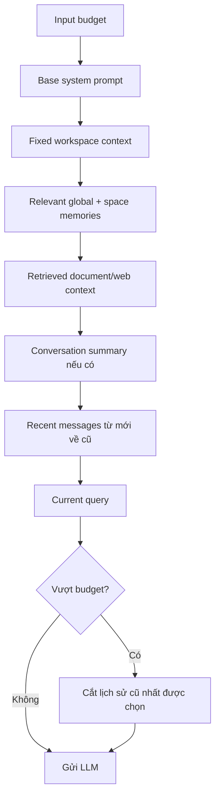

# Flow 12 — Context window 128K tokens

## Công thức ngân sách

```text
Total context window        = 128,000 tokens
Normal output reserve       =   8,000 tokens
Normal input budget         = 120,000 tokens
Research output reserve     =  12,000 tokens
Research input budget       = 116,000 tokens
```



## Current context viewer

`GET conversation detail` tính token và trả:

- `context_token_count`, `context_token_limit=128000`.
- `context_can_compact`.
- `context_items`: summary hoặc message với ID, role, content, token count.

UI hiển thị used/remaining/usage và nút xóa riêng từng item.

## Thứ tự ưu tiên

System/fixed/memory/retrieved/current query có cấu trúc cố định; history được fit từ message mới nhất về trước. Nếu message biên quá dài, phần cần thiết được truncate để vừa budget.

## Token count

Project dùng tokenizer helper để ước lượng/đếm token. Meter là context app đang quản lý, không phải số token nội bộ chính xác mà provider cuối cùng báo sau request.

## Code liên quan

- `backend/src/agent/context/builder.py`
- `backend/src/core/tokenizer.py`
- `backend/src/api/routes/chat.py`
- `frontend/src/components/chat/ContextWindowBar.jsx`

