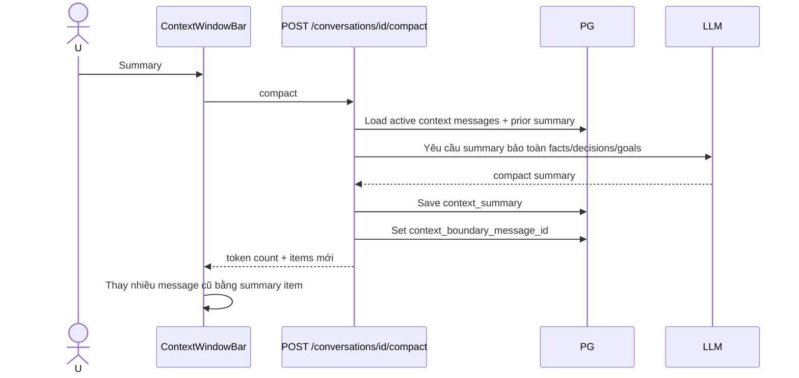

# Flow 13 — Summary/compaction context

## Mục tiêu

Giải phóng context token nhưng giữ thông tin quan trọng để chat tiếp. Đây không phải tóm tắt hiển thị như một assistant message trong transcript.

## Điều kiện

- Conversation tồn tại và có dữ liệu đủ để compact.
- `context_can_compact=true`.
- Không đang stream/load/action.

## Sau compaction

- Summary trở thành một item context độc lập.
- Boundary xác định message cũ nào đã được đại diện bởi summary.
- Message sau boundary tiếp tục được đưa trực tiếp vào context.
- Transcript hiển thị không nhất thiết bị xóa.

## Xóa summary

Nút trash trên summary gọi cùng endpoint remove context item; backend xóa `context_summary`/boundary phù hợp thay vì xóa một `ChatMessage`.

## Code liên quan

- `backend/src/api/routes/chat.py`
- `backend/src/storage/postgres.py`
- `frontend/src/pages/ChatPage.jsx`
- `frontend/src/components/chat/ContextWindowBar.jsx`

