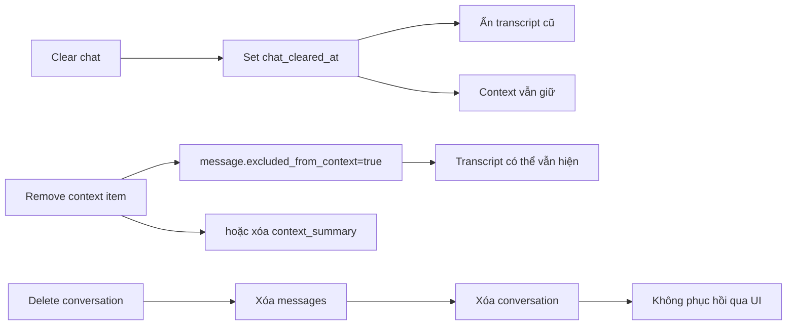

# Flow 14 — Clear chat, remove context và delete conversation

## Ba thao tác khác nhau

| Thao tác | Transcript | Context cho câu sau | Bản ghi conversation |
|---|---|---|---|
| Clear chat | Ẩn message trước timestamp | Giữ nguyên | Giữ |
| Trash trong Current context | Không nhất thiết ẩn | Loại item | Giữ |
| Delete conversation | Xóa | Xóa | Xóa |

## Clear chat

UI confirm rõ “current context window will be kept”, gọi `POST /clear`, xóa state message/artifact ở client. Lần mở lại conversation, backend chỉ trả visible message sau `chat_cleared_at`.

## Remove context item

`DELETE /context/{item_id}`. Với message, backend đặt cờ excluded để audit/transcript không bị phá. UI tải lại detail để cập nhật token meter.

## Delete

Sidebar confirm rồi gọi `DELETE /conversations/{id}`. Nếu đang mở conversation đó, UI chọn conversation còn lại đầu tiên nếu có.

## Code liên quan

- `backend/src/api/routes/chat.py`
- `frontend/src/pages/ChatPage.jsx`
- `frontend/src/components/chat/ContextWindowBar.jsx`

