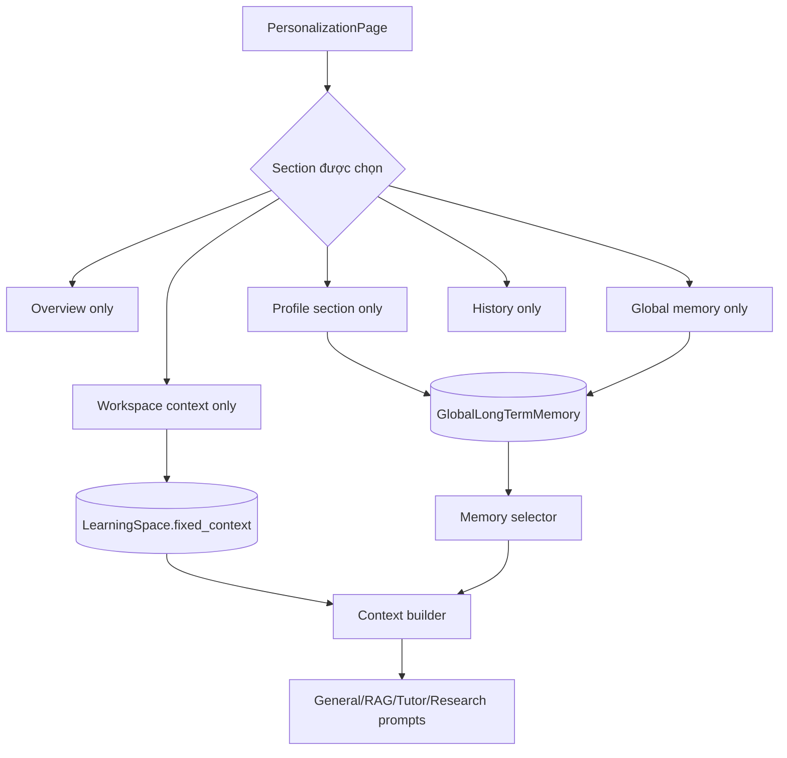

# Flow 15 — Personalization, global memory và workspace context

## UI section isolation

Sidebar giữ `activeSection`; click Overview chỉ render overview, click Goals/Preferences/... chỉ render form của section đó. Không phải trang dài hiển thị tất cả section cùng lúc.

## Global memory

- CRUD tại `/profile/memories`.
- Profile fields được map thành category/key/value/importance.
- Dùng xuyên General Chat, mọi Learning Space, Tutor và Research.
- Có thể thêm memory tùy chỉnh, edit, forget từng memory hoặc clear toàn bộ.

## Space memory và fixed context

- Space memories tại `/spaces/{id}/memories`.
- Fixed workspace context tại `/spaces/{id}/context`, giới hạn 12.000 ký tự.
- Chỉ dùng khi request có đúng `space_id`.

## Chọn memory cho prompt

Backend lấy tối đa 50 candidate, chấm relevance lexical với query và importance, chọn tối đa 8 memory phù hợp; global và local được format thành context riêng.

## Ranh giới privacy

UI giải thích phạm vi nhưng hiện code dùng learner/user mặc định trong nhiều endpoint; chưa có authentication boundary hoàn chỉnh ở flow này.

## Code liên quan

- `frontend/src/pages/PersonalizationPage.jsx`
- `frontend/src/api/profile.js`, `spaces.js`
- `backend/src/agent/context/memory.py`
- `backend/src/api/routes/profile.py`, `spaces.py`

