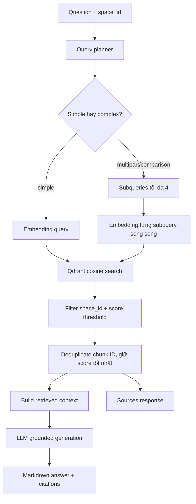

# Flow 16 — RAG hỏi đáp tài liệu

## Input

- Query, `space_id`, `top_k` mặc định 5, score threshold.
- Fixed context, relevant memories và recent history.

## Retrieval

Normal RAG là vector-first. Payload Qdrant cung cấp text/source/document/chunk/page. Search luôn có filter `space_id` từ Learning Chat.

## Generation

System prompt yêu cầu trả lời từ context, dùng Markdown, hỗ trợ math và trích nguồn. Nhánh direct RAG có thể stream token thật từ provider.

## Không có context

Generator phải nói không đủ evidence thay vì bịa từ tài liệu. Một số fallback kỹ thuật có thể trả message định trước khi LLM/provider không dùng được.

## Output

`answer`, `sources` và route metadata. Frontend map sources sang `fileId/chunkId/chunkIndex/page/url` để click mở.

## Code liên quan

- `backend/src/rag/pipeline.py`
- `backend/src/rag/retriever.py`
- `backend/src/rag/query_planner.py`
- `backend/src/rag/generator.py`

