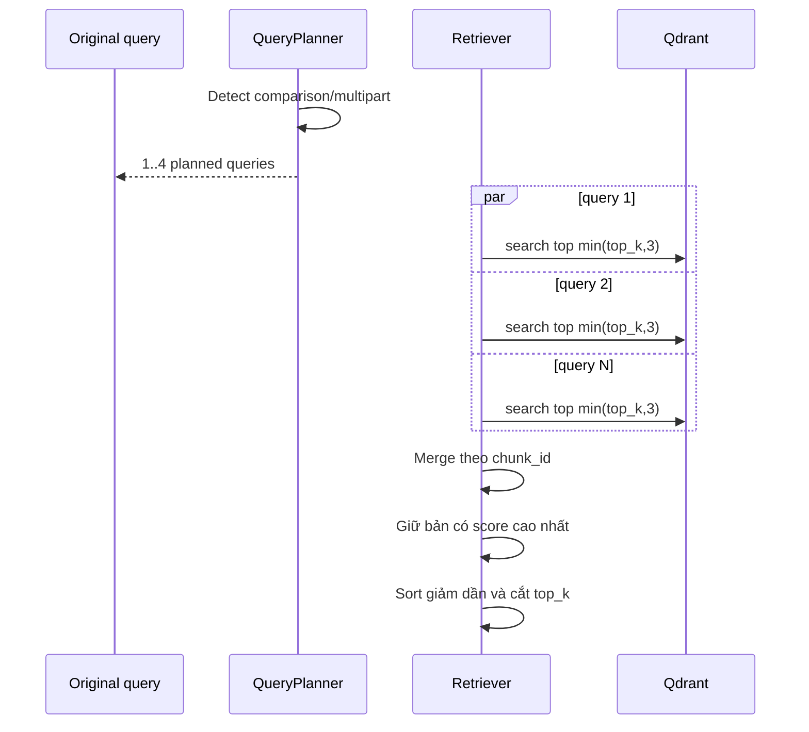

# Flow 17 — Multi-query retrieval

## Khi được kích hoạt

Query planner nhận diện câu nhiều phần hoặc yêu cầu so sánh. Query đơn giản không chịu overhead này.

## Mục đích

- Tăng recall cho câu chứa nhiều khía cạnh.
- Tránh một embedding duy nhất làm mờ các vế.
- Giữ tổng context bounded nhờ giới hạn query và top result.

## Ranh giới

- Tối đa 4 subquery.
- Mỗi subquery lấy tối đa 3 khi complex.
- Deduplicate bằng chunk ID, không lặp cùng đoạn trong prompt.
- Đây khác Deep Research query rewrite: RAG planner nhẹ hơn, chỉ phục vụ một lượt retrieval.

## Code liên quan

- `backend/src/rag/query_planner.py`
- `backend/src/rag/pipeline.py`
- `backend/src/rag/retriever.py`

