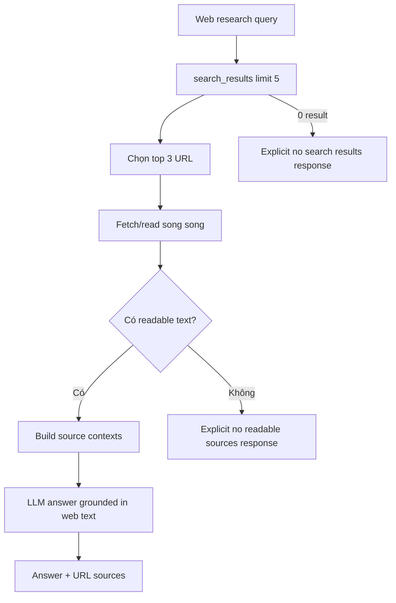

# Flow 18 — Simple web research

## Phạm vi

Đây là node web đơn giản, khác Deep Research. Nó thực hiện một search → fetch → answer, không lập 3–6 research questions, không evaluate coverage và không lặp.

## Search provider

Tool ưu tiên provider được cấu hình (ví dụ Tavily nếu có key) và có fallback search. Fetch loại nội dung không đọc được/URL lỗi.

## Giới hạn

- Search tối đa 5 result.
- Fetch top 3.
- Chất lượng phụ thuộc provider và khả năng site cho fetch.
- Nếu fallback search bị HTTP 403 hoặc không có API key/provider khả dụng, flow trả không có nguồn thay vì tạo answer không grounded.

## Code liên quan

- `backend/src/agent/nodes.py`
- `backend/src/agent/tools/web_search.py`
- `backend/src/agent/tools/web_fetch.py`

