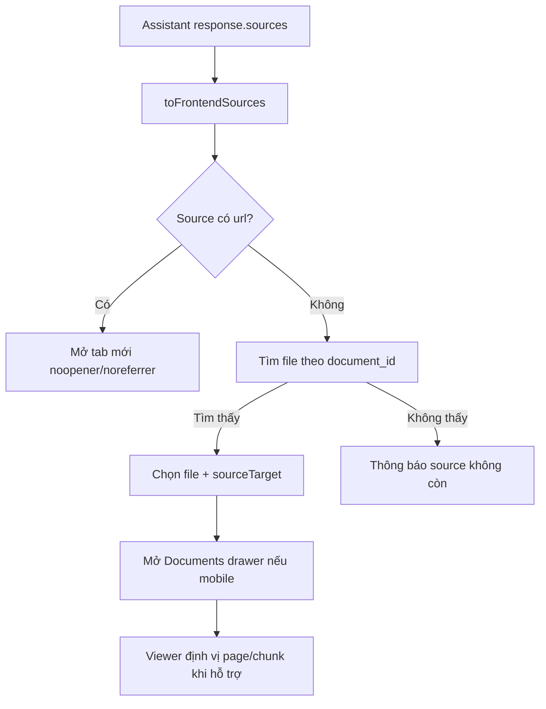

# Flow 19 — Citation và mở nguồn

## Shape source frontend

`fileId`, `chunkId`, `chunkIndex`, `text`, `fileName`, `page`, `score`, `url`.

## Nguồn RAG/Tutor

Source trỏ tới uploaded document. UI chuyển sang viewer bên trái; PDF có thể dùng page metadata, text dùng excerpt/chunk.

## Nguồn Research/Web

Source có URL được mở ngoài browser. Deep Research còn dùng citation số `[n]` trong report; backend kiểm tra citation phải tồn tại và nằm trong catalog trước khi chấp nhận report LLM.

## Grounding rule

Evidence extractor chỉ giữ excerpt nếu normalized excerpt thực sự nằm trong source text; candidate hallucinated bị discard.

## Code liên quan

- `frontend/src/api/chat.js`
- `frontend/src/pages/LearnPage.jsx`
- `frontend/src/components/chat/MessageList.jsx`
- `backend/src/agent/research/nodes/extract.py`, `synthesize.py`
