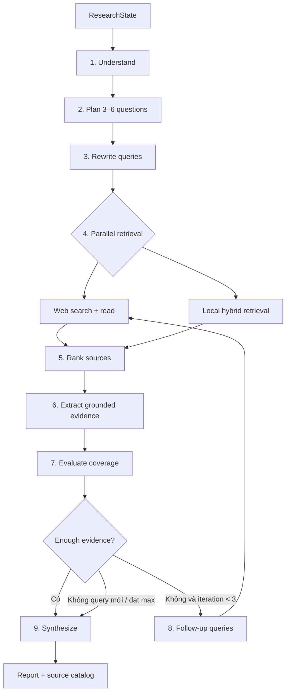

# Flow 20 — Deep Research orchestration tổng thể

## ResearchState mang theo

Query, space, fixed/memory/history, understanding, plan, query maps, searched queries, web/local/ranked sources, evidence, iteration, missing topics, report, sources và progress callback.

## Bound trung tâm

- Tối đa 3 iteration search.
- 3–6 research questions.
- Tối đa 3 query variants/question.
- Tối đa 10 web source tổng, chừa 3 slot cho follow-up.
- Local rerank top 4/question.
- Final output tối đa 12.000 tokens.

## Tính incremental

Mỗi node mutate cùng `ResearchState`. Source có cờ `extracted` để vòng sau chỉ extract nguồn mới. `searched_queries` ngăn search lặp vô hạn.

## Code liên quan

- `backend/src/agent/research/graph.py`
- `backend/src/agent/research/state.py`
- `backend/src/agent/research/config.py`
- `backend/src/agent/research/nodes/*`

