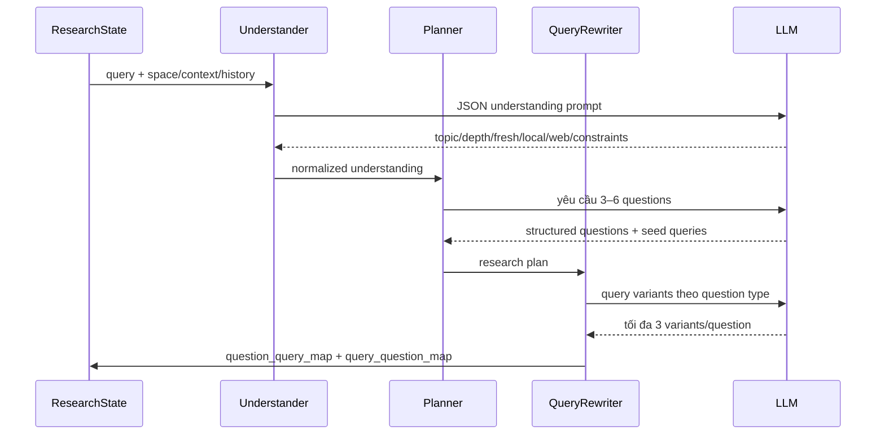

# Flow 21 — Research understand, plan và query rewrite

## Understand

Xác định topic, depth, nhu cầu thông tin mới, dùng local/web và constraints. Regex fallback nhận từ khóa latest/current và uploaded/file. Nếu không có space, local luôn bị tắt. Từ “brief/ngắn” buộc depth brief; mặc định research sâu.

## Plan

Pydantic validation bắt buộc 3–6 câu hỏi unique, số search query tương ứng, ID unique. Fallback luôn tạo ba hướng: background, mechanism/evidence, practical trade-offs/limitations/cost.

## Rewrite

Theo loại câu hỏi, fallback thêm biến thể như `latest official`, `study results`, `limitations criticism`, `technical explanation`. Query được normalize, dedupe toàn plan và map ngược về research question để evidence coverage đúng chủ đề.

## Khi LLM lỗi

Mỗi node có deterministic fallback; research vẫn chạy với chất lượng planning thấp hơn nhưng không dừng toàn pipeline.

## Code liên quan

- `nodes/understand.py`, `planner.py`, `query_rewrite.py`
- `models/plan.py`, `prompts.py`

