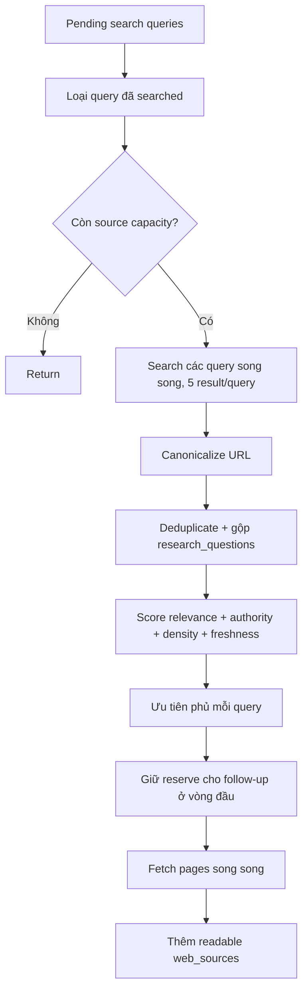

# Flow 22 — Deep Research web search và đọc nguồn

## Canonical URL

Chỉ chấp nhận HTTP/HTTPS có hostname; bỏ fragment, slash cuối và tracking `utm_*`, `fbclid`, `gclid`; normalize default port và sort query params.

## Chấm nguồn

- Relevance bằng overlap term query/question với title/snippet/text.
- Authority cao hơn cho `.gov`, `.edu`, arXiv, DOI, Nature, ACM, IEEE, NIH.
- Evidence density dựa độ dài text.
- Freshness chỉ tham gia khi understanding yêu cầu thông tin mới.

## Chống mất coverage

Ranker chọn ít nhất một candidate cho mỗi search query trước khi lấp slot còn lại. Vòng đầu chỉ dùng tối đa capacity trừ follow-up reserve.

## Lỗi

Exception của một query hoặc URL chỉ log và skip; `asyncio.gather(return_exceptions=True)` không làm hỏng toàn research. Nếu tất cả nguồn lỗi, synthesizer tạo grounded no-evidence fallback.

## Code liên quan

- `backend/src/agent/research/nodes/search.py`
- `backend/src/agent/research/nodes/source_ranker.py`
- `backend/src/agent/tools/web_search.py`, `web_fetch.py`

