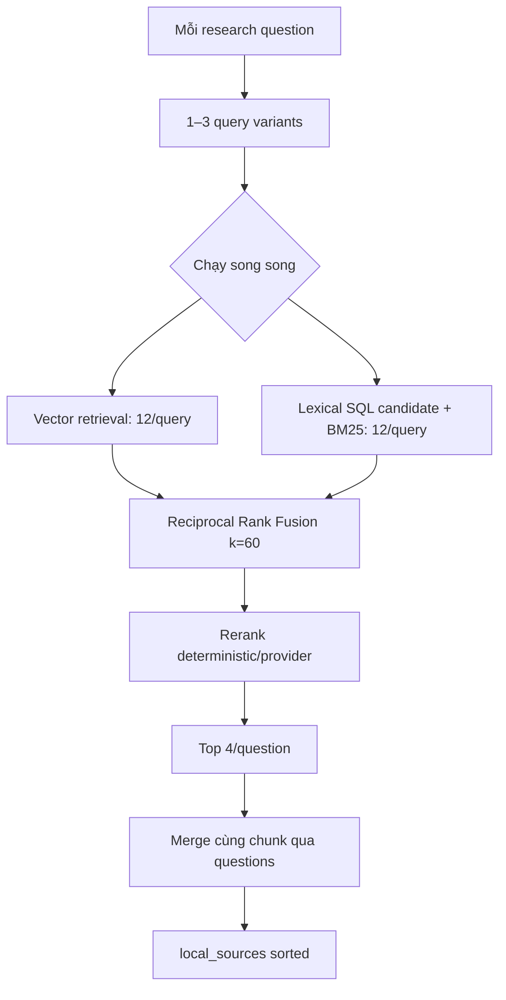

# Flow 23 — Deep Research local hybrid retrieval

## Vector branch

Embedding query → Qdrant cosine → filter `space_id`, threshold 0.0 trong research để ưu tiên recall.

## Lexical branch

1. Tách token Unicode dài ít nhất 3.
2. SQL `ILIKE` theo tối đa 12 term và bắt buộc `Document.space_id`.
3. Scan tối đa 240 chunk.
4. Chấm BM25 cục bộ và normalize score.

## Fusion và rerank

RRF cộng `1/(60+rank)` từ mỗi batch/method, normalize theo max và ghi `retrieval_methods`. Reranker fallback kết hợp term overlap, phrase match và fusion/retrieval score.

## Deduplication

Identity ưu tiên `document_id + chunk_index`, sau đó `chunk_id`. Một chunk dùng cho nhiều question chỉ lưu một source nhưng gộp danh sách `research_questions`; bản score tốt hơn thắng.

## Điều kiện bỏ qua

Không có `space_id`, understanding tắt local, hoặc plan rỗng.

## Code liên quan

- `nodes/retrieve_local.py`
- `retrieval/hybrid.py`, `lexical_search.py`, `reranker.py`

