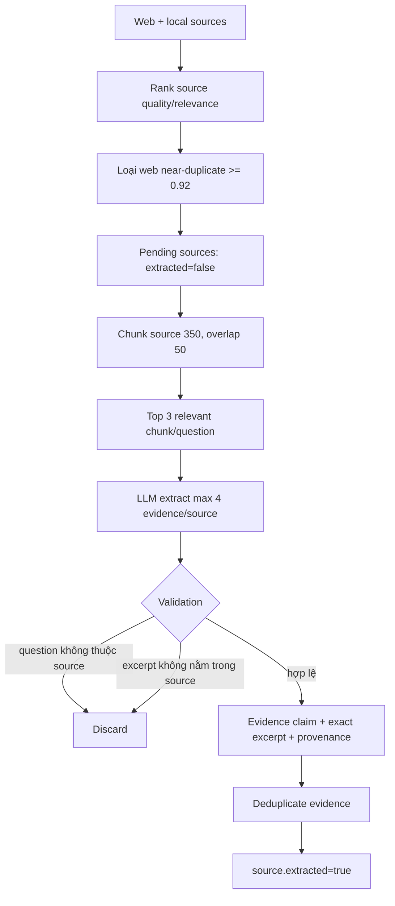

# Flow 24 — Rank nguồn và extract evidence

## Evidence contract

Mỗi evidence có claim, excerpt, research question, source title/type và provenance tùy loại: URL hoặc document/chunk/space/score/retrieval methods.

## Chống hallucination ở extraction

Candidate LLM chỉ được giữ nếu:

1. `research_question` đúng một question source được gán.
2. Normalized evidence excerpt là substring của selected grounding text.

Nếu LLM lỗi/không có client, fallback lấy excerpt thật từ chunk liên quan và câu đầu làm claim.

## Near duplicate

Web sources được so text tối đa 5.000 ký tự bằng `SequenceMatcher`; tỷ lệ ≥0.92 hoặc text giống hệt chỉ giữ nguồn rank cao hơn.

## Code liên quan

- `nodes/source_ranker.py`
- `nodes/extract.py`
- `ingestion/chunker.py`

