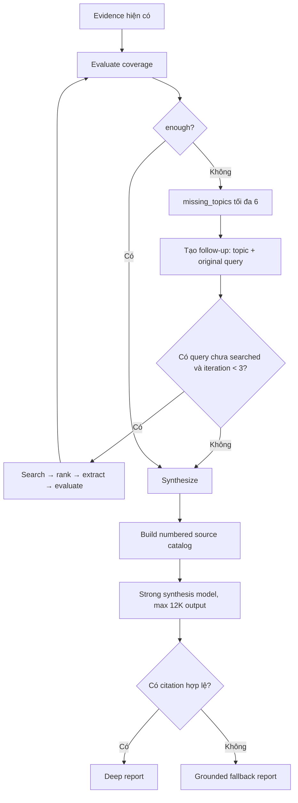

# Flow 25 — Evaluate, follow-up và synthesize research

## Evaluation

LLM trả JSON `enough` và missing topics. Fallback tính coverage: question nào không có evidence là missing. `enough` không thể true nếu evidence rỗng.

## Follow-up

Mỗi missing topic tạo query gắn original query. Query đã search bị loại. Vòng chỉ tăng khi search thực sự chạy; graph dừng khi không còn map follow-up hoặc đạt 3 iteration.

## Synthesis

- Source identity web = URL; local = chunk identity.
- Evidence được đánh số theo source.
- Depth target: brief 600–1.000, standard 1.200–2.000, deep 1.800–3.000 words.
- Model mặc định lấy `RESEARCH_SYNTHESIS_MODEL_NAME`, khác model chat thường nếu cấu hình.
- Input budget 116K, output cap 12K.

## Citation validation

Report LLM bị thay bằng fallback nếu rỗng, không có citation `[n]`, hoặc citation vượt catalog. Fallback chỉ diễn giải evidence thật và liệt kê limitations/sources; do đó khi 0 evidence sẽ hiện “No grounded evidence...” thay vì bài viết bịa.

## Code liên quan

- `nodes/evaluate.py`, `nodes/synthesize.py`
- `config.py`, `graph.py`

