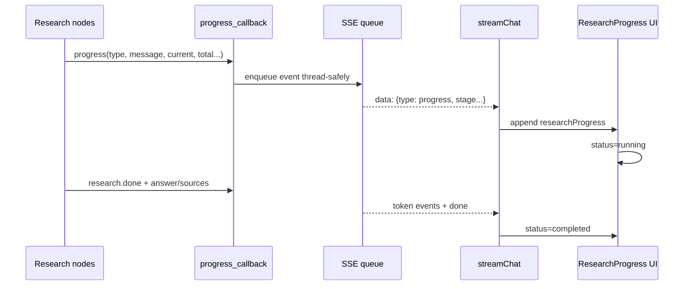

# Flow 26 — Research progress SSE và UI

## Stage có thể xuất hiện

`research.understand`, `plan`, `rewrite`, `search`, `read`, `retrieve_local`, `rerank`, `rank_sources`, `extract`, `evaluate`, `synthesize`, `done`.

## An toàn payload

API không chuyển nguyên event nội bộ. `safe_research_progress` chỉ cho stage, message, current, total, status đi ra client; answer/sources trong `research.done` nội bộ không bị lặp trong progress event.

## UI

Assistant placeholder chứa `researchProgress[]` và `researchStatus`. Component hiển thị timeline/progress compact trong message. Nếu stream exception, message đang running đổi failed và UI thêm error message.

## Đặc điểm streaming

Progress là realtime theo node. Final research report hiện được tạo đầy đủ trước, sau đó API phát ra theo token/word chunks; đây không phải provider token stream trong lúc synthesis.

## Code liên quan

- `backend/src/agent/research/state.py`
- `backend/src/api/routes/chat.py`
- `frontend/src/api/chat.js`
- `frontend/src/components/chat/ResearchProgress.jsx`

