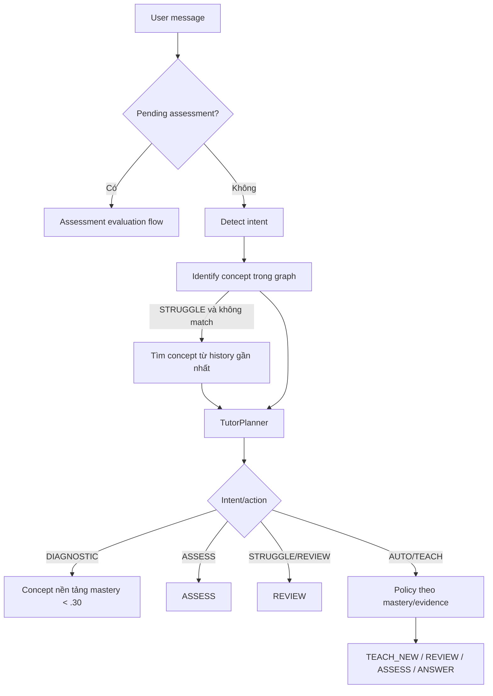

# Flow 27 — Tutor intent và planning

## Intent

Regex song ngữ nhận `DIAGNOSTIC`, `ASSESS`, `STRUGGLE`, `REVIEW`, `TEACH`; không khớp là `AUTO`.

## Concept matching

Ưu tiên tên concept xuất hiện trực tiếp trong message; nếu không, chấm overlap token và ưu tiên difficulty thấp hơn khi hòa. Không có match thì policy chọn concept tiếp theo có prerequisites đạt.

## Policy mastery

- `<0.40`: REVIEW nếu đã có evidence học, nếu chưa thì TEACH_NEW.
- `0.40–<0.70`: REVIEW.
- `0.70–<0.85`: ASSESS.
- `>=0.85`: ANSWER hoặc chuyển sang concept kế tiếp.
- Prerequisite phải đạt ít nhất 0.70 để mở concept sau.

## Struggle behavior

Tutor ghi nhận struggle làm giảm confidence 10% nhưng không tự hạ mastery; sau đó tập trung REVIEW concept hiện tại/được suy từ history.

## Code liên quan

- `backend/src/tutor/intents.py`
- `backend/src/tutor/planner.py`
- `backend/src/tutor/policy.py`
- `backend/src/tutor/service.py`

