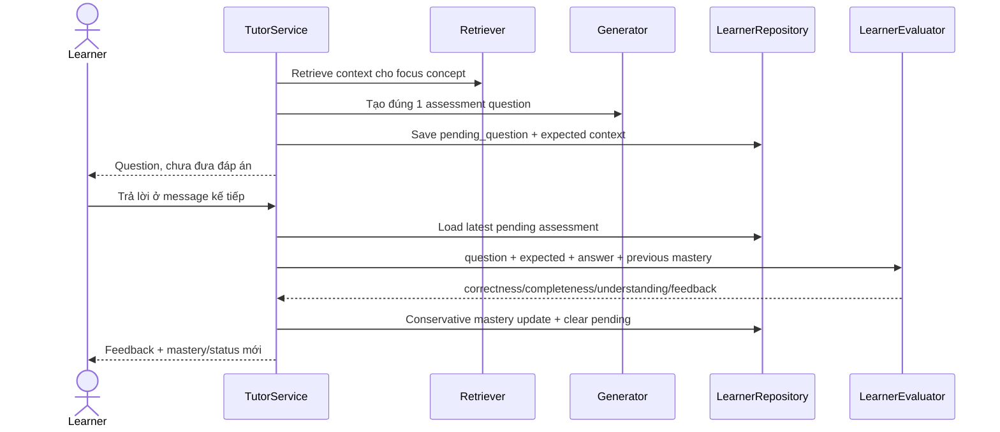

# Flow 28 — Tutor assessment và cập nhật mastery



## Công thức evidence

```text
evidence = 0.50*correctness + 0.20*completeness + 0.30*understanding
learning_rate = 0.14 nếu evidence >= previous, ngược lại 0.20
new = previous + learning_rate*(evidence-previous)
```

Một câu trả lời không thể nhảy thẳng từ 0 lên mastered. Confidence tăng dần 12% phần còn thiếu. Evidence ≥0.65 tăng correct count, thấp hơn tăng wrong count.

## Self-report

“Tôi đã biết/hiểu” chỉ tăng nhẹ confidence, không tăng mastery. Đây là guard chống mastery giả do tự khai.

## Provider unavailable

Nếu evaluator không dùng được, pending assessment được giữ, mastery không đổi và Tutor báo có thể resume sau.

## Trạng thái

- `<0.30 unknown`
- `<0.60 learning`
- `<0.80 familiar`
- `>=0.80 mastered`

## Code liên quan

- `backend/src/tutor/service.py`
- `backend/src/learner/evaluator.py`
- `backend/src/learner/mastery.py`
- `backend/src/learner/repository.py`

