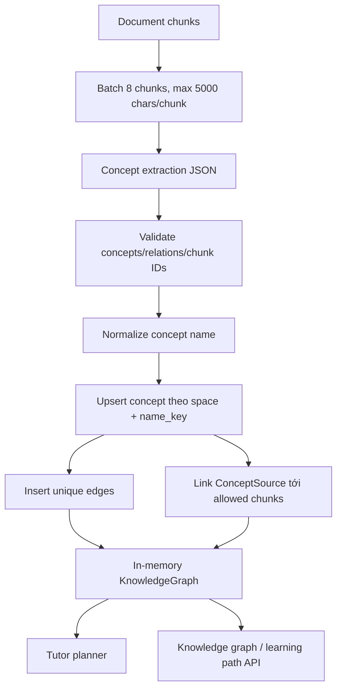

# Flow 29 — Knowledge graph từ tài liệu

## Entity

- Concept: name, normalized key, summary, difficulty 1–5.
- Relation cho phép: `prerequisite_of`, `part_of`, `related_to`, `uses`.
- ConceptSource: many-to-many concept ↔ document chunk, là grounding.

## Persist an toàn

Chunk ID do LLM trả chỉ được chấp nhận nếu chunk thật thuộc document trong đúng space. Concept trùng được merge/update; self-edge bị bỏ; edge unique không insert lặp.

## Traversal

`KnowledgeGraph` là view in-memory theo space, cung cấp prerequisites, next concepts và related. Tutor policy dựa prerequisites để không dạy concept sau quá sớm.

## API overlay

`GET /knowledge-graph` gắn mastery/confidence/status theo learner và source chunk IDs vào mỗi node; edges giữ relation.

## Code liên quan

- `backend/src/knowledge/extractor.py`
- `backend/src/knowledge/repository.py`
- `backend/src/knowledge/models.py`, `graph.py`
- `backend/src/ingestion/pipeline.py`

