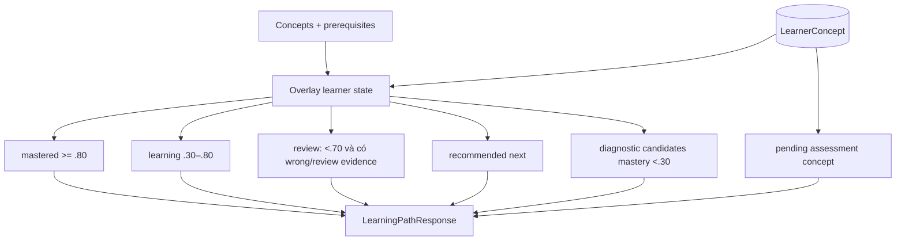

# Flow 30 — Learner state và learning path

## Learner identity và scope

Unique key là `(learner_id, space_id, concept_id)`. API mặc định `learner_id=default_session`; trong Tutor, `session_id` của chat được truyền làm learner ID.

## Learner state endpoint

Trả mọi concept trong space, kể cả chưa có row (mặc định mastery/confidence/count = 0), status và cờ assessment pending.

## Recommended next

Policy bỏ concept đã mastered ≥0.85 và concept bị exclude; chỉ chọn khi toàn prerequisites ≥0.70. Sorting cân nhắc số prerequisites, difficulty, mastery và name.

## Diagnostic

Chọn tối đa 5 concept mastery <0.30, ưu tiên nền tảng ít prerequisite, difficulty thấp. Pending assessment mới nhất được trả riêng để UI/agent tiếp tục đúng concept.

## Code liên quan

- `backend/src/api/routes/spaces.py`
- `backend/src/learner/repository.py`, `mastery.py`
- `backend/src/tutor/policy.py`, `planner.py`
