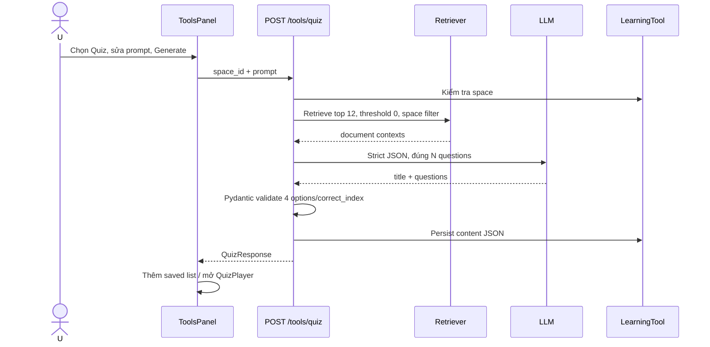

# Flow 31 — Quiz

## Số câu

Parser đọc số trong prompt tiếng Anh/Việt; mặc định 10, clamp 1–30. LLM phải trả đúng số, nếu không API trả lỗi generation.

## Grounding

Prompt bắt buộc chỉ dùng context retrieved, tránh trick question và phủ nhiều concept. Không có context → 400; không có API key/provider/structure sai → 502.

## UI lifecycle

Prompts tùy chỉnh lưu `localStorage`. ToolsPanel load saved quiz khi đổi space, có thể mở player hoặc xóa tool. Quiz answer/progress trong player là UI state; cấu trúc quiz gốc được lưu backend.

## Code liên quan

- `backend/src/agent/tools/quiz_generator.py`
- `backend/src/api/routes/tools.py`
- `frontend/src/components/workspace/ToolsPanel.jsx`
- `frontend/src/components/workspace/QuizPlayer.jsx`

