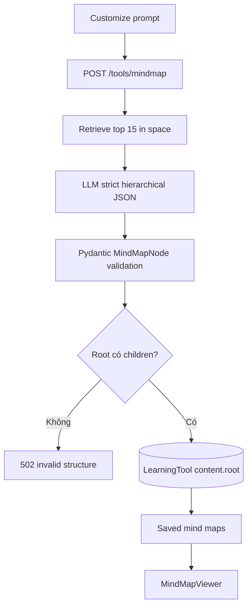

# Flow 32 — Mind map

## Contract generation

- Một central root.
- 3–8 major branches khi context hỗ trợ.
- Không quá 3 level dưới root.
- Label ngắn, description factual, không duplicate và không invent ngoài source.

## Persist và hiển thị

Backend lưu recursive root JSON. List endpoint serialize lại thành `MindMapResponse`. UI cho mở viewer, quay lại danh sách hoặc xóa.

## Lỗi

Không có document context → 400. Thiếu OpenAI key, JSON/Pydantic invalid hoặc provider lỗi → 502. Tool không được persist nếu validation thất bại.

## Code liên quan

- `backend/src/agent/tools/mindmap_generator.py`
- `backend/src/api/routes/tools.py`
- `frontend/src/components/workspace/MindMapViewer.jsx`

