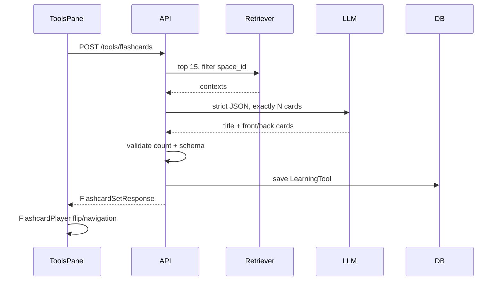

# Flow 33 — Flashcards

## Số thẻ

Prompt parser nhận số card/flashcard/thẻ; mặc định 15, clamp 1–50. LLM phải trả đúng số.

## Nội dung

Mỗi front kiểm tra một concept và back không mơ hồ; có thể trộn definition, relationship, process, application nếu tài liệu hỗ trợ. Không duplicate/invent.

## State

Set gốc lưu backend. Trạng thái đang xem/lật thẻ thuộc player frontend. Saved sets được reload theo space và xóa qua endpoint chung `/tools/{id}`.

## Code liên quan

- `backend/src/agent/tools/flashcard_generator.py`
- `backend/src/api/routes/tools.py`
- `frontend/src/components/workspace/FlashcardPlayer.jsx`

