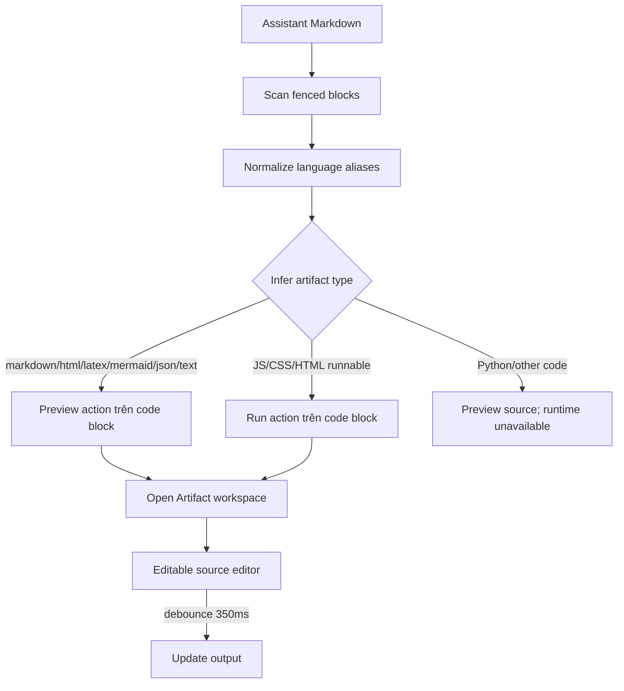

# Flow 34 — Artifact detection, preview, edit và run

## Detection

`extractArtifacts` chỉ tạo artifact từ fenced code block và display-math `$$...$$`/`\[...\]`; không gắn Preview cho toàn câu trả lời. Alias: `py→python`, `js/jsx→javascript`, `tex/math→latex`, `md→markdown`, v.v.

## Renderers

- Markdown: ReactMarkdown + GFM + KaTeX.
- JSON: parse và pretty print.
- Mermaid: lazy import, strict security, SVG.
- HTML: sandboxed iframe.
- LaTeX: chuyển document subset thành Markdown/KaTeX.
- Code: syntax highlight; runtime chỉ cho JS/CSS/HTML hiện tại.

## Edit

Source dùng `react-simple-code-editor`, highlight.js và caret cam sáng. Output cập nhật sau 350 ms. Reset đưa về nội dung artifact gốc; Copy lấy nội dung draft hiện tại và báo `Copied` 1,5 giây.

## JavaScript sandbox

Chạy trong Web Worker, chặn fetch/XHR/WebSocket/EventSource/importScripts và module import, capture console/result, timeout 5 giây, có Stop/Run again. Đây là sandbox frontend, không chạy Python/backend code.

## HTML/CSS sandbox

Iframe `sandbox=allow-scripts`, inject CSP không network. HTML preview không-run dùng sandbox rỗng; CSS dùng sample canvas.

## Code liên quan

- `frontend/src/utils/artifacts.js`
- `frontend/src/components/chat/MessageBubble.jsx`
- `frontend/src/components/chat/TutorOutputPanel.jsx`

