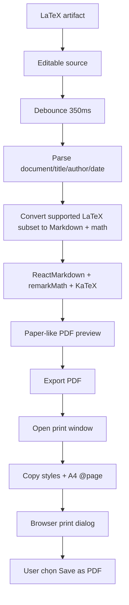

# Flow 35 — LaTeX preview và export PDF

## LaTeX subset hiện hỗ trợ

- `\documentclass`, `\begin{document}`, title/author/date và `\maketitle`.
- Section/subsection/paragraph.
- Equation/align/gather, inline/display math.
- Bold, italic, typewriter, underline cơ bản.
- Page break và một số spacing được đơn giản hóa.

Đây không phải TeX engine đầy đủ; package, macro tùy chỉnh, TikZ hoặc layout phức tạp có thể không render giống LaTeX thật.

## Export

Không tạo PDF server-side. UI mở cửa sổ print chứa HTML preview, áp `@page A4` và gọi `window.print`; người dùng chọn Save as PDF. Popup bị chặn sẽ hiện feedback.

## Code liên quan

- `frontend/src/components/chat/TutorOutputPanel.jsx`: `latexDocument`, `LatexPreview`, `exportPdf`

