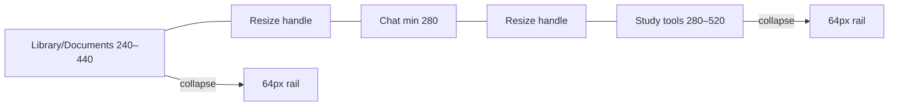

# Flow 36 — Resizable và responsive workspace

## Learning Workspace ba cột

1. Pointer drag thay width; kéo thấp hơn min thêm 36px thì collapse.
2. Keyboard separator: arrows ±16, Shift ±32, Home collapse, End max.
3. Width/collapse lưu `icu-workspace-layout`.
4. Resize browser tự giảm right trước, rồi left, để giữ center tối thiểu 280px.
5. Dưới `lg`, left/right thành full overlay drawers, mở từ edge tabs hoặc header.
6. PDF viewer có thể làm left “unbounded” để người dùng mở rộng vùng đọc; click citation tự restore left nếu collapsed.

## ICU Tutor

- Sidebar desktop từ `lg`; artifact desktop từ `xl`.
- Trên màn nhỏ, mỗi panel là drawer overlay.
- Width lưu localStorage bằng key riêng.
- Khi resize, max được tính từ viewport, width panel kia và center reserve khoảng 430px.
- Artifact bên trong còn có divider ngang 22–75% giữa Source và Output.

## Code liên quan

- `frontend/src/components/workspace/ResizableWorkspace.jsx`
- `frontend/src/pages/ChatPage.jsx`
- `frontend/src/components/chat/TutorOutputPanel.jsx`
- `frontend/src/index.css`

