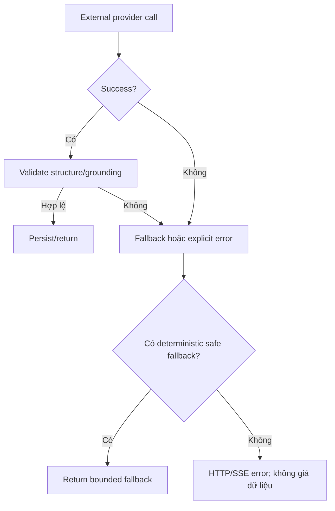

# Flow 37 — Error và fallback matrix

| Khu vực | Lỗi/điều kiện | Hành vi hiện tại |
|---|---|---|
| Startup | Port PostgreSQL/Qdrant bị chiếm | Container không start; Docker báo bind error |
| Upload | Space/file type không hợp lệ | HTTP 4xx; UI bỏ temporary file |
| Ingestion | Parse/embed/vector/DB exception | Document `failed`, lưu error message |
| Embedding | Không có/lỗi OpenAI | Deterministic fallback embedding |
| RAG | Không có relevant chunks | Trả insufficient-context response |
| Chat stream | HTTP/SSE lỗi | Assistant progress → failed; thêm error bubble |
| Context meter refresh | Lỗi sau answer | Giữ answer; chỉ fallback `canCompact=true` |
| Research planning | LLM/JSON lỗi | Fallback plan 3 questions |
| Research extraction | LLM lỗi | Exact-excerpt fallback |
| Research web | Search/fetch một nguồn lỗi | Skip nguồn, tiếp tục nguồn khác |
| Research web | Mọi nguồn lỗi/0 source | Grounded no-evidence report |
| Research synthesis | Citation thiếu/sai | Grounded fallback report |
| Tutor evaluation | Provider unavailable | Không đổi mastery, giữ pending assessment |
| Learning tools | Không context | 400 |
| Learning tools | API key/LLM/JSON invalid | 502, không persist tool |
| Mermaid | Parse/render lỗi | Hiển thị error trong artifact panel |
| JS run | Import/network/exception | Console error; runtime stopped |
| JS run | Quá 5 giây | Terminate worker, timed out |
| PDF export | Popup blocked | Feedback yêu cầu allow pop-up |
| Source click | File đã xóa | UI notice source unavailable |

## Nguyên tắc tổng quát quan sát được

## Hạn chế vận hành đáng chú ý

- Web research cần search provider hoạt động; fallback public search có thể bị 403.
- Backend cho CORS rộng và nhiều flow dùng default user/learner; authentication/authorization production chưa thể hiện đầy đủ.
- PostgreSQL, Qdrant và filesystem không có transaction phân tán.
- Learning Chat UI chưa reload persisted history sau refresh.

## Code liên quan

- `backend/src/**`, đặc biệt route exception mapping và node fallback
- `frontend/src/api/*.js`, pages và artifact components

