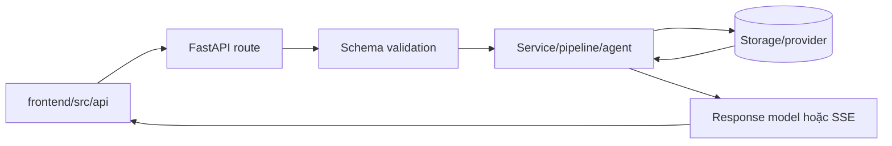

# Flow 38 — API endpoint map

Base prefix: `/api/v1`.

## Chat và conversation

| Method | Path | Flow |
|---|---|---|
| GET | `/chat/conversations` | List conversation theo chat type |
| POST | `/chat/conversations` | Tạo conversation |
| GET | `/chat/conversations/{id}` | Visible transcript + active context |
| POST | `/chat/conversations/{id}/compact` | Summary context |
| DELETE | `/chat/conversations/{id}/context/{item}` | Loại context item |
| POST | `/chat/conversations/{id}/clear` | Ẩn chat, giữ context |
| DELETE | `/chat/conversations/{id}` | Xóa conversation |
| POST | `/chat/general` | General sync response |
| POST | `/chat/general/stream` | General/Research SSE |
| POST | `/chat/query` | Learning query sync |
| POST | `/chat/stream` | Learning RAG/Tutor/Research SSE |

## Spaces, knowledge và memory

| Method | Path | Vai trò |
|---|---|---|
| GET/POST | `/spaces` | List/create space |
| DELETE | `/spaces/{id}` | Xóa space và resources |
| GET | `/spaces/{id}/knowledge-graph` | Graph + mastery overlay |
| GET | `/spaces/{id}/learner-state` | State từng concept |
| GET | `/spaces/{id}/learning-path` | Mastered/learning/review/next/diagnostic |
| GET/PUT | `/spaces/{id}/context` | Fixed workspace context |
| GET/POST | `/spaces/{id}/memories` | List/create local memory |
| PUT/DELETE | `/spaces/{id}/memories/{memory_id}` | Update/delete local memory |
| GET/POST | `/profile/memories` | List/create global memory |
| PUT/DELETE | `/profile/memories/{id}` | Update/delete global memory |
| DELETE | `/profile/memories` | Clear global memory |

## Documents

| Method | Path | Vai trò |
|---|---|---|
| POST | `/documents/upload` | Save + enqueue ingestion |
| GET | `/documents` | List metadata/status |
| GET | `/documents/{id}` | Poll/detail |
| GET | `/documents/{id}/content` | Raw file/PDF viewer |
| GET | `/documents/{id}/text` | Extracted text/chunks |
| DELETE | `/documents/{id}` | Xóa DB/vector/file |

## Learning tools

| Method | Path | Vai trò |
|---|---|---|
| GET | `/tools?space_id=&tool_type=` | Saved tools |
| POST | `/tools/quiz` | Generate + persist quiz |
| POST | `/tools/mindmap` | Generate + persist mind map |
| POST | `/tools/flashcards` | Generate + persist cards |
| DELETE | `/tools/{id}` | Delete saved tool |

## Request path tổng quát

## Code liên quan

- `backend/src/api/main.py`
- `backend/src/api/routes/*.py`
- `backend/src/api/schemas.py`
- `frontend/src/api/*.js`
