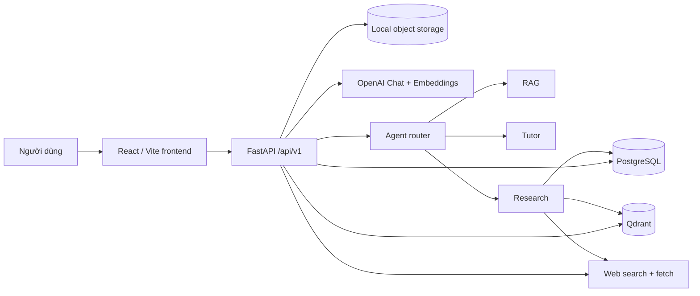

# Learn with ICU — Flow Map

Tài liệu này mô tả hành vi **đang tồn tại trong code**, không phải bản thiết kế mong muốn. Mỗi flow nằm trong một file riêng để có thể đọc, review và cập nhật độc lập.

## Bản đồ cấp cao

## Danh sách flow

### Nền tảng và dữ liệu

1. [Khởi động hệ thống](01-system-startup.md)
2. [Khởi động frontend và điều hướng](02-frontend-bootstrap-routing.md)
3. [Vòng đời Learning Space](03-learning-space-lifecycle.md)
4. [Upload tài liệu từ UI](04-document-upload.md)
5. [Pipeline ingestion và indexing](05-document-ingestion-indexing.md)
6. [Đọc, trích chọn và xóa tài liệu](06-document-reader-selection-delete.md)
7. [Mô hình dữ liệu và quan hệ lưu trữ](07-data-storage-map.md)

### Chat, context và memory

8. [Agent routing](08-agent-routing.md)
9. [General Chat streaming](09-general-chat-streaming.md)
10. [Learning Chat streaming](10-learning-chat-streaming.md)
11. [Vòng đời conversation](11-conversation-lifecycle.md)
12. [Context window 128K](12-context-window.md)
13. [Summary/compaction context](13-context-compaction.md)
14. [Clear chat, remove context và delete conversation](14-chat-clear-remove-delete.md)
15. [Personalization và memory](15-personalization-memory.md)

### RAG và nguồn

16. [RAG hỏi đáp tài liệu](16-rag-question-answering.md)
17. [Multi-query retrieval](17-multi-query-retrieval.md)
18. [Simple web research](18-simple-web-research.md)
19. [Citation và mở nguồn](19-citations-source-opening.md)

### Deep Research Agent

20. [Research orchestration tổng thể](20-deep-research-orchestration.md)
21. [Understand, plan và rewrite query](21-research-understand-plan-rewrite.md)
22. [Research web search và đọc nguồn](22-research-web-search.md)
23. [Research local hybrid retrieval](23-research-local-hybrid-retrieval.md)
24. [Rank nguồn và extract evidence](24-research-rank-extract.md)
25. [Evaluate, lặp bổ sung và synthesize](25-research-evaluate-synthesize.md)
26. [Research progress SSE và UI](26-research-progress-ui.md)

### Tutor và học thích nghi

27. [Tutor intent và planning](27-tutor-intent-planning.md)
28. [Tutor assessment và cập nhật mastery](28-tutor-assessment-mastery.md)
29. [Knowledge graph từ tài liệu](29-knowledge-graph.md)
30. [Learner state và learning path](30-learner-state-learning-path.md)

### Công cụ và workspace

31. [Quiz](31-quiz-flow.md)
32. [Mind map](32-mindmap-flow.md)
33. [Flashcards](33-flashcards-flow.md)
34. [Artifact detection, preview và run](34-artifact-preview-run.md)
35. [LaTeX preview và export PDF](35-latex-preview-pdf.md)
36. [Resizable/responsive workspace](36-resizable-responsive-workspace.md)
37. [Error và fallback matrix](37-error-fallback-matrix.md)
38. [API endpoint map](38-api-endpoint-map.md)

## Quy ước đọc sơ đồ

- Hình trụ là nơi lưu dữ liệu lâu dài.
- Nhánh có chữ “fallback” là hành vi code thực hiện khi provider ngoài không sẵn sàng.
- `session_id` trong Learning Chat đồng thời được dùng làm `learner_id` cho Tutor.
- “General Chat” có conversation được load lại từ backend; Learning Chat hiện giữ message theo space trong state của trang và reset khi reload trang.

## Phạm vi đã đọc

- `backend/src`: API, agent, context, ingestion, knowledge, learner, RAG, storage, tutor và workers.
- `frontend/src`: entrypoint, API clients, pages, chat components, workspace, artifact rendering và learning tools.
- `tests`: dùng để đối chiếu các contract quan trọng và fallback.
- `docker-compose.yml`, `dev.sh`, cấu hình runtime.

